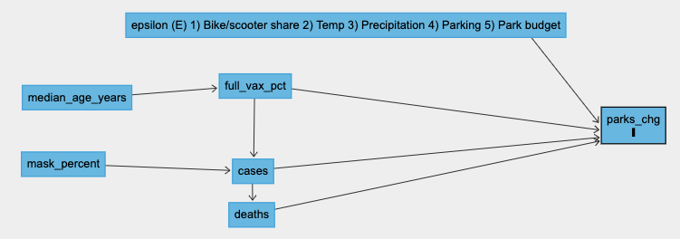

\clearpage

```{r setup, include=FALSE, warning=FALSE, message=FALSE}
# install.packages('corrplot')

library(corrplot)
library(ggplot2)
library(tidyverse)
library(car)
library(lmtest)
library(sandwich)
library(stargazer)
library(patchwork)
```

```{r setup chunks, include=FALSE}
knitr::opts_chunk$set(echo = TRUE)
```


```{r source functions from project, echo = FALSE, include=FALSE}
source('../src/data/clean_and_join.R')
```

```{r Data Wrangling, include=FALSE}
parks <- read_csv('/Users/maxhoff/MIDS/w203/working/lab_02/lab_2_Whiteley_Hoff_McCormick/data/external/Google_Mobility_Report_out.csv')
vax <- read_csv('/Users/maxhoff/MIDS/w203/working/lab_02/lab_2_Whiteley_Hoff_McCormick/data/external/CDC_Vaccinations_out.csv')
covid <- read_csv('/Users/maxhoff/MIDS/w203/working/lab_02/lab_2_Whiteley_Hoff_McCormick/data/external/covid_cases_data.csv')
mask_use <- read_csv('/Users/maxhoff/MIDS/w203/working/lab_02/lab_2_Whiteley_Hoff_McCormick/data/external/mask-use-by-county.csv')
age <- read_csv('/Users/maxhoff/MIDS/w203/working/lab_02/lab_2_Whiteley_Hoff_McCormick/data/external/census_demographics.csv')
```

```{r clean_and_join data from source function, include=FALSE}
data <- clean_and_join()
head(data)
```


# Introduction

The Covid-19 pandemic has upended lifestyles to a degree that most people could not have imagined a decade ago. The local community impacts of the Covid-19 ranged from uncertain financial situations, limited recreational options, all the way up to widespread anxiety and loss of loved ones. One of the more interesting changes to lifestyles has been a significant increase in visits to parks, as local travel and indoor recreational activities have been curbed by stay-at-home orders.

Given they are free to use while providing a gathering place for a wide range of diverse groups, parks serve a valuable function to society. The importance of parks on a community's physical and mental wellbeing is well documented (Rice et al 2020, Samuelson et al 2020), but became especially relevant to consider as the pandemic spread. As developed world vaccinations increase, this raises an interesting question around the future of public spaces and more specifically public parks. Which lifestyle changes will become a permanent fixture of American life? Will increased public park usage go the way of cloud computing and remote work? The answers to these questions have important implications for city planners (Honey-Roses et al 2020), local government officials, and Department of Tourism officials across the country.


# Research Question and Theoretical Model

Our main goal for our research project is to explore whether a causal relationship exists between visits to public parks and Covid-19 vaccination rates in the United States. Specifically, how do Covid-19 vaccination rates within a county impact visits to parks within that county?  
 
Finding the answer to this question will bring important insight into how the Department of Tourism should allocate resources towards parks, especially in counties with limited park space. Additionally, it will allow county officials to better understand park use as a passing trend or a mainstay of society after vaccinated citizens have the opportunity to return to indoor activities. If our evidence shows that there is not a meaningful relationship between park visits and Covid-19 vaccination rates within a county, our default action/recommendation is one of inaction. 
 
If our evidence does indeed indicate a meaningful relationship between park visits and Covid-19 vaccination rates within a county, the Department of Tourism and policymakers in states with lower vaccination rates should reallocate resources to account for this. We predict that counties with higher vaccination rates will show lower park usage.
 
Through our explanatory modeling process, we plan to leverage the data sources below to operationalize and test parameters of the following causal theory: counties with high vaccination rates are returning to pre-pandemic activities faster and will not continue use of public parks as seen during the pandemic.
 
The relationships explained through our analysis are related by the following 


# Data and Variables of Interest

To begin our modeling process, we needed to define the exact variable that we wanted to measure. Since we were researching how the rates of vaccinations affect park visits within a county, it made sense that our outcome variable was change in park visits from a baseline date (sometime pre-Covid-19) to current date (more details to follow). 

Our next step was to think of all the possible variables that could influence park visits and then explore data that was readily available in a comparable format to our output variable. From a conceptual level, there were all sorts of variables that we thought of that could influence park visits, but as we learned, not much data was available. Most of our ideation around influential variables were related to quantifying a propensity to visit a park. For example, the amount of parks available in a given region, the quality of these parks, the amount of lifestyle alternatives compared to parks (e.g., dining availability, amusement parks, etc.). We would then be able to control for these variables, leaving us with the true effect that vaccinations had on park visitation. Ideation for the amount of variables to control for seemed endless, but unfortunately, we were able to find very little data that was actually of use. 

After much searching, we were able to obtain a couple datasets that we hypothesized to have an influence on park visitation. The first dataset was obtaining age data by county from the [U.S. census](https://www2.census.gov/programs-surveys/popest/datasets/2010/2010-eval-estimates/). Our hypothesis was that age might be a useful predictor in determining propensity to visit a park. Without being able to find other measures that indicate park visitation propensity, we thought age might be a useful substitute for at least a portion of the variables that make up propensity. Our reasoning behind this was that the average age of a population might be influential in park visitation, as younger people might be more active, and thus more likely to visit a park. 

Another distinct influential factor that we thought might influence visitation was attitudes towards Covid-19. Across the U.S., attitudes and policies have varied widely that most likely had a significant influence on mobility of a population. We searched for several datasets that might quantify these attitudes in some way, and we eventually stumbled upon a [New York Times dataset](https://github.com/nytimes/covid-19-data/tree/master/mask-use) that measured attitudes towards wearing masks. We believed that this might be a good proxy for general attitudes towards Covid-19. We thought attitudes towards Covid-19 might be one of the most influential factors in park visitation, and being able to control for this in some way would have a significant positive effect in being able to interpret our results.

As for predictor and target variables, the datasets we used were a [mobility dataset from Google](https://www.google.com/covid19/mobility/), which gave us a percentage change in visitation to parks by U.S. county, and a [vaccination dataset from the CDC](https://data.cdc.gov/Vaccinations/COVID-19-Vaccinations-in-the-United-States-County/8xkx-amqh), which gave us vaccination rates for all U.S. counties.

We also stumbled upon an [additional dataset from the New York Times](https://www.nytimes.com/article/coronavirus-county-data-us.html) which gave us case counts and death counts by U.S. county, which we thought could potentially be useful.

Additional detail on each of these datasets is below:

## Datasets

- __COVID-19 Community Mobility Report__: This data that was collected by Google, describes the percent increase/decrease of visits to specific categories of locations such as retail centers, transit stations, grocery store, etc. In our case, we will be looking at the percent trends over time of visits to parks. The data coverage begins from a baseline measurement taken on January 1st, 2021 and is updated routinely. Since we will not be performing a time-series analysis, we decided to select a slice of the data from June 30th, 2021. The variables that we are concerned with in this data set are the FIPS code (used for merging data by county) and the park visits change from baseline.

- __CDC Data on Vaccinations__: This data set was provided by the CDC and contained much information on vaccination rates at a county level. It contains both hard vaccination rates and percentages. Additionally, it provides these vaccination numbers drilled down to age subsets as well as at a cumulative level. Lastly, this data contains a FIPS code for data merging. The variables of concern for this data set are the FIPS code, the hard cumulative vaccination rate, and the percentage vaccination rate. We decided not to use any of the age subset rates since we hypothesize that all age demographics are reasonably likely to visit a park. 

- __New York Times Covid-19 Data__: This data set is similar to the vaccination data provided by the CDC but instead reports on actual Covid-19 cases at a county level. In addition to case data, this data set also contains reports on deaths from Covid-19 as well. This data set is structured in a time series format, similar to the Covid-19 Community Mobility Report. So in order to choose a proper cross-section for analysis, we selected cases from 2-weeks before our selected date for the park visits percent change (June 30th, 2021) up until 2-weeks after, based on the CDC's recommendation of a two week life-cycle for virus contraction to full recovery. The variables that we are concerned with in this data set are the FIPS code, date (for cross-section selection), county, case counts, and death counts.

- __Mask-Wearing Survey Data__: In the same repository as the NYT Covid-19 data set, we found another data set that came from a large number of interviews conducted online by a survey firm named Dynata at the request of The New York Times. They surveyed people at a county level about their mask use between July 2nd and July 14th. Since this survey collection period is so close to the covid case date cross section we selected and the date selected for park visit percent change, we're assuming that the respondent's mask wearing habits are not going to change that much so we can use this as one of our explanatory variables. The variables of concern for this data set are FIPS code and mask use.

- __Census Demographic Data__: Lastly, we utilized the United States Census Bureau's Population Estimates Program data releases to retrieve a data set that describes the population size and median age of an area at the county level. The variables of concern in this data set are the FIPS code, the population size, and the median age.

## Variables

To begin our modeling process, we needed to define the exact variables that we wanted to measure. The table below explicitly states the ones we'll reference throughout this report:


```{r Covariate and Variable Name Table, warning=FALSE, message=FALSE,echo=FALSE}
variable_names <- c("full_vax_count", "full_vax_pct", "log_10_cases", 
                    "log_10_deaths", "mask_percent", "median_age_years")

covariates <- c("Number of citizens vaccinated in a particular county", 
               "Percent of citizens vaccinated in a particular county", 
               "Log transformed count of cases in a particular county", 
               "Log transformed count of deaths in a particular county", 
               "Percentage of the population that reported wearing masks frequently", 
               "Median age of the population of a particular county")

cov_var_names <- data.frame("Covariate" = covariates, "Variable Name" = variable_names)

col_names <- c("Covariate", "Variable Name")
knitr::kable(cov_var_names, col.names = col_names)
```


## EDA

Now that we had our data collected and our hypothesis and research goal laid out, it was time to explore the data. A good first step in any Exploratory Data Analysis (EDA) is conducting data quality checks.

### Data Quality Checks

We examined each of the variables to dig up any potential errors or problems with the dataset, and determine whether any adjustments needed to be made. We started our investigation by looking at the distributions for each of the variables:

#### Distributions

```{r histograms, echo=FALSE, message=FALSE, fig.width=15, fig.height=6}
park_traffic_histogram <- data %>% 
    ggplot() + 
    aes(x=parks_chg) + 
    geom_histogram(color='firebrick4', fill="firebrick1") +
    labs(x='Percent Change', y='Bin Count', 
         title='Distribution of Change Percentages for Park Traffic',
         subtitle = "Figure 1")

vax_rate_histogram <- data %>% 
    ggplot() + 
    aes(x=full_vax_pct) + 
    geom_histogram(color='darkblue', fill="lightblue") +
    labs(x='Percent Fully Vaccinated', y='Bin Count', 
         title='Distribution of Population Percentages of Fully Vaccinated Individuals by County',
         subtitle = "Figure 2")

covid_case_histogram <- data %>% 
    ggplot() + 
    aes(x=cases) + 
    geom_histogram(color='darkgreen', fill="lightgreen") +
    scale_x_log10() + 
    labs(x='Numer of Cases in County', y='Bin Count', 
         title='Distribution of Case Counts per County',
         subtitle = "Figure 3")

covid_death_histogram <- data %>% 
    ggplot() + 
    aes(x=deaths) + 
    geom_histogram(color='purple', fill="violet") +
    scale_x_log10() + 
    labs(x='Numer of Deaths in County', y='Bin Count', 
         title='Distribution of Death Counts per County',
         subtitle = "Figure 4")

mask_use_histogram <- data %>% 
    ggplot() + 
    aes(x=mask_percent) + 
    geom_histogram(color='orange', fill="darkorange") + 
    labs(x='Percent of Residents Who Always Wear Masks in Public', y='Bin Count', 
         title='Distribution of Percentage Mask Use by County',
         subtitle = "Figure 5")

age_histogram <- data %>% 
    ggplot() + 
    aes(x=median_age_years) + 
    geom_histogram(color='blue', fill="darkblue") +
    scale_x_log10() + 
    labs(x='Median Age', y='Bin Count', 
         title='Distribution of Median Age by County',
         subtitle = "Figure 6")

park_traffic_histogram/vax_rate_histogram/age_histogram|covid_case_histogram/covid_death_histogram/mask_use_histogram
```

At first glance, in Figures 1 through 6, it seems like we may need to conduct some log transformations to several of the variables, given the long tailed distributions. 

#### CDC Dataset Investigation

While examining the CDC vaccination dataset we stumbled upon the `Completeness_pct` variable, which states the proportion of vaccination people that listed a valid FIPS code (county code). 

```{r cdc data analysis, fig.align="center",fig.width = 15,fig.height=3, echo=FALSE, message=FALSE}
#investigate what the completeness percentage means. How reliable is our vaccination percentage field?
CDC_reliability <- data %>%
  ggplot() +
  geom_histogram() +
  aes(x = percent_vax_w_fips) +
  ggtitle(label = 'How reliable is our vaccination percentage field?', subtitle = 'Figure 7') +
  labs(x = '% Valid Vaccination Response', y = 'Count' )

CDC_reliability
```

We were hoping that almost all counties would have a value of close to 100 percent, but as you can see in Figure 7, a material proportion of the counties have values that might impact our results.

Let’s dig further into this. It looks like the counties with 100 percent invalid FIPS codes are coming from two states; Hawaii and Texas. Let’s see how these counties are distributed in terms of vaccination percentages as a whole:


```{r texas and hawaii scatter, fig.align="center",fig.width = 15,fig.height=3, echo=FALSE, message=FALSE}
tx_hi_scatter <- data %>%
  filter(state == 'TX' | state == 'HI') %>%
  ggplot()+
  geom_point() +
  aes(x = full_vax_count, y = parks_chg) +
  ggtitle(label = 'Texas and Hawaii Vaccination Percentages', subtitle = "Figure 8") +
  labs(x = 'Vaccination Count', y = '% Park Change')

tx_hi_scatter 
```

```{r tx_and_hi_filter, include=FALSE, message=FALSE}
data <- data %>%
  filter(state != 'TX' | state != 'HI')
```


As you can see in Figure 8, all counties within these two states have invalid results, thus we should exclude these in our analyses going forward.

#### Region Analysis

Our next set of investigations was related to how each of these variables change by region, since we thought some of the variances for each of our variables might be clustered well by region. This could potentially invalidate our findings, since counties might be not well distributed. If certain regions contain more counties than others, then our data might not meet the Independent and Identically Distributed (IID) assumption of the Classic Linear Model (CLM).

Figure 9 below shows how park visits relates to the median age of a county, broken down by region (shown by color). We would not have to worry about IID if there is no discernible difference between the different regions. Also, we were hoping to find not much difference in county size, as shown by the size of each of the points on the scatter.

```{r age_parks_scatter, fig.align="center",fig.width = 15,fig.height=5, echo=FALSE, message=FALSE}
age_parks_scatter <- data %>%
  ggplot() +
  geom_point() +
  aes(x = median_age_years, y = parks_chg, size = census_population, color = region) +
  ggtitle(label = 'Change in Park Visits by Region',
          subtitle = 'Figure 9') +
  labs(x = 'Age', y = '% Park Change') +
  theme(legend.text = element_text(size=8))
  

age_parks_scatter
```


As you can see in Figure 9, unfortunately there is a discernible difference between the regions of the country, as we suspected in our original hypothesis. We’ll have to revisit this when we build our model. As for county size, it looks like county size is fairly well distributed, so this shouldn't be a problem.

#### County size investigation

Another topic that we were interested in was whether county size could have an impact on changes in park visits. Theoretically, smaller counties could have larger swings in park visitation, since they will have smaller bases to work off of. For example, if a county has only two residents, if one person goes to a park who never did before, then park visitation will have a 50% increase. Compare that to a county with 10 residents, if 1 person goes, then then will only see a 10% increase. 

Figure 10 plots how park visitation is affected by population size. We were hoping park visitation would not be affected by population size.

```{r parks_county_size, fig.align="center",fig.width = 15,fig.height=4, echo=FALSE, message=FALSE, warning=FALSE}
parks_by_county_size <- data %>%
  ggplot() +
  geom_point() +
  aes(x = implied_population, y = parks_chg) +
  ggtitle(label = 'Park Visitation Changes by Population Size', 
          subtitle = 'Figure 10') +
  labs(x = 'Population', y = '% Park Change')

parks_by_county_size
```

As you can see from Figure 10, unfortunately it does look like smaller counties can have larger swings in park visitation. This is one more item we’ll have to consider when building our model and interpreting results.

#### Variable Correlations

Now that we've pressure tested our dataset, let's take an initial look at how strong the correlations are:

```{r, vax_park_scatter, fig.align="center",fig.width = 15,fig.height=4, echo=FALSE, message=FALSE, warning=FALSE}
park_vs_vax_scatter <- 
  data %>% 
    ggplot() + 
    aes(x=full_vax_count, y=parks_chg) + 
    scale_x_log10() + 
    geom_point() +
    geom_smooth() +
    labs(x='Number of Vaccinations', y='Percent Change in Traffic at Parks', 
         title='Vaccination Count VS Change in Park Traffic by County',
         subtitle = 'Figure 11')

park_vs_vax_scatter
```

At first glance, Figure 11 shows that the correlation does not look very strong. We have not applied any transformations yet though, so it's possible that the data just needs some cleaning.

Diving more deeply into the specific variables, Figure 12 below the correlation between each of them:

```{r correlation, fig.align="center", echo=FALSE, message=FALSE, warning=FALSE}
corrplot::corrplot(cor(data[c("parks_chg", "full_vax_pct", "full_vax_count" , 
                              "cases", "deaths", "mask_percent", 
                              "median_age_years")], use = "complete.obs"
                       ), 
                   method = "color", order="AOE", 
                   tl.srt=45, tl.col="black",
                   type = "upper", 
                   diag=FALSE, addCoef.col = "white")
```
Figure 12


Unsurprisingly, there are very strong correlations between cases, deaths, and vaccination rates. The correlation between deaths and cases might even be strong enough to bring about problems of perfect collinearity (or near perfect collinearity), which we'll discuss in more detail later. As for the other variables, correlations were high enough to make us believe that a strong model might be built.

```{r, include=FALSE}
model_1 <- lm(parks_chg ~ full_vax_pct, data=data)
model_2 <- lm(parks_chg ~ full_vax_pct + log10(cases), data=data)
model_3 <- lm(parks_chg ~ full_vax_pct + full_vax_count + log10(cases) + mask_percent + median_age_years, data=data)

```


# Model Building Process

To begin our modeling process, we needed to define the exact variable that we wanted to measure. Since we are researching how the rates of vaccinations effect park visits within a county, it made sense that our outcome variable would be the percent change in park visits from the Covid-19 Community Mobility Report data set from Google. Note that the parks category includes regions such as national parks, public beaches, marinas, dog parks, plazas, and public gardens. Given the flexibility in the definition of a park for this analysis, we want to make clear the range of the outcome variable that we are analyzing.

To measure the percent change in park visits, we hypothesized that the main explanatory variable would be the rate of vaccinations within a county. In a way, the vaccination rate of a particular region somewhat symbolizes a transition state out of pandemic operations for that region. We are unsure how this will affect the number of visitations to a particular park or set of parks however. On the one hand we have parks becoming a replacement for other locations that were closed during the pandemic, so this may indicate that park traffic will decrease as vaccination rates increase and people become more comfortable being in close quarters again. On the other hand, we have the possibility that people were nervous about going to parks during the pandemic, so in this case, we may expect to see an increase in park traffic as regions transition out of pandemic tendencies. In addition to the vaccination rate of a region, we also have identified the number of cases in a region as an explanatory variable. One thing we've noted for this additional explanatory variable, however, is that there is likely a strong level of collinearity between the number of cases and vaccination rate/count. We will discuss this further in the model limitations section. In addition to these two main explanatory variables, we have identified a few other covariates we plan on including in the larger versions of the model; we will discuss these further below. The final conclusion we plan on reaching is one that explains the causal nature of vaccination rates, and case rates for that matter, on the percent change in visits to parks in an area. 

Because of the nature of our variables and the causal effect that we are searching for, we have determined our model to be an explanatory model. We decided to start off with a base model or *limited model* that just regresses the change in park traffic on vaccination rate. Since this is the key variable which we are trying to determine a causal relationship for, we decided it best to use this as the only explanatory variable in our first model. 

In our second model however, we decided to include the case count variable as a covariate. As mentioned before, we identified some collinearity between cases and vaccination rates in our EDA which may give rise to a little uncertainty in the results. That being said, we feel that including this covariate will still influence the outcome variable so it is important to include, as long as we are aware of the potential effects. Another alteration we made to the second model was adding a log transformation to the cases covariate. While performing the EDA, we noticed that the distribution of the cases variable had a pretty strong right skew, so we added a log transformation the bring the variable closer to a normal distribution.

Finally, for our third model, we included all relevant covariates that were available and that we believed would have an influence on the change in park visits from baseline. So in addition to vaccination percentage and case count variables, we also included vaccination count, mask-wearing percentages, and the median age in years per county. Furthermore, we also decided to include vaccination count in addition to vaccination percentage since we figured that vaccination count would carry some additional information because of the raw size of the vaccine count numbers speaking to the size of the county in question. Again, we needed to perform a log transformation on the covid cases variable in order to achieve linearity. It is important to point out that moreso than model two, there will be some collinearity between some of the explanatory variables in the third model iteration. For starters, we still have the collinearity between vaccination percentage and case counts, but now we also have collinearity between vaccination count, mask percentage, and median age. Addressing the final variable of median age, it is possible that there is some collinearity between this variable and the other explanatory variables, however according to our correlation plot in the EDA section, it seems like there is only a small correlation between median age and vaccine count. At a high level, the variables we've included in the third model combine to more or less explain the severity of the pandemic in a particular region in addition to the response. And to wrap it all up, this explanation is the key that we are using to measure our outcome variable of change from baseline in visits to parks.


### F-Test

We run an F-test to get an indication if our additional features are improving performance of the model. The null hypothesis is that the short model is as good at explaining the variance in `parks_chg` as the two long models.The rejection criteria used is p-value < 0.05 for the F-Test.
We conclude that we are able to reject the null hypothesis for Model 3 but not Model 2, as our test returned a p-value much lower than 0.05 for Model 3. As a result, we can conclude that the additional features in Model 3 are improving the performance of our model and that our model improved more than if all those indicators had been set to zero.

```{r f test, message=FALSE, warning=FALSE, echo=FALSE}
anova(model_1, model_2, model_3, test = "F")
```
Figure 13


### Regression Table
```{r latex output, warning=FALSE, message=FALSE, echo=FALSE}

se.model_1 = coeftest(model_1, vcov = vcovHC)[ , "Std. Error"]
se.model_2 = coeftest(model_2, vcov = vcovHC)[ , "Std. Error"]
se.model_3 = coeftest(model_3, vcov = vcovHC)[ , "Std. Error"]

stargazer(model_1, model_2, model_3, type = "text",
          se = list(se.model_1, se.model_2, se.model_3),
          star.cutoffs = c(0.05, 0.01, 0.001), title = "Table 1: The relationship between vaccination rates and park traffic")

```
Figure 14


# Model Limitations

Our limitations around finding data set some tight constraints in how we built our model. Those constraints led us to make trade-offs which added limitations to our model. Upon Assessing all five assumptions of the CLM, we found evidence that our model does not fit all the necessary assumptions for the CLM framework - specifically the assumptions for linear conditional expectation, and homoskedastic errors. There was also debatability for whether we met the IID assumption, which we'll discuss below. That being said, our sample size is rather large at 390 counties, so with the CLT holding due to our large sample sie, we are able to have some flexibility with the CLM assumptions.

### IID Sampling

As discussed in the EDA section, there are some clusters when you organize the data by region, which might lead one to believe that IID is violated. This on it’s own might be enough to invalidate our model, but we believe the addition of the mask wearing variable is enough to counteract this problem. 

```{r fig.align="center",fig.width = 15, fig.height=10, echo=FALSE, message=FALSE} 
age_masks_scatter <- data %>%
  ggplot() +
  geom_point() +
  aes(x = median_age_years, y = parks_chg, size = census_population, color = mask_percent) +
  ggtitle(label = 'Change in Park Visits by Mask Sentiment',
          subtitle = 'Figure 15') +
  theme(legend.position = "none") +
  labs(x = 'Age', y = '% Park Change') +
  theme(legend.text = element_text(size=8))

age_parks_scatter / age_masks_scatter
```

Shown in Figures 9 is the same distribution of park visits by age as shown in the EDA section, but shown in Figure 16 is the chart replicated but broken out by mask sentiment. As you can see, the mask sentiment shows a rough similarity in clustering compared to region. Although there is some subjectivity in our conclusion, we believe that the mask sentiment variable will control enough for this clustering to satisfy most of the IID assumption.

There are other potential problems with the data gathering process that could lead to IID issues, for example using only data from Google users which could exclude some older populations, but we believe these problems to be minimal, and most likely will not influence our results much.

### Linear Conditional Expectation  

To assess whether there is a linear conditional expectation, we've looked at the predicted vs. residuals of both Model 1 and Model 3. The plot of both, shown below in Figures 17 and 18, indicates a pretty clear non-linear relationship. This is concerning and does not give us confidence that there is a linear conditional expectation here.

```{r code and plots assessing linear conditional expectation, fig.align="center",fig.width = 15,fig.height=8, echo=FALSE, message=FALSE }

model_1_lce <- data %>% 
  mutate(
    model_preds = predict(model_1), 
    model_resids = resid(model_1)
  ) %>% 
  ggplot(aes(model_preds, model_resids)) + 
  geom_point() + 
  stat_smooth() +
  ggtitle(label = 'Model 1 Predicted Values vs. Residuals',
          subtitle = 'Figure 16') +
  labs(x = 'Predictions', y = 'Residuals')
  

model_3_lce <- data %>% 
  mutate(
    model_preds = predict(model_3), 
    model_resids = resid(model_3)
  ) %>% 
  ggplot(aes(model_preds, model_resids)) + 
  geom_point() + 
  stat_smooth() +
  ggtitle(label = 'Model 3 Predicted Values vs. Residuals',
          subtitle = 'Figure 17') +
  labs(x = 'Predictions', y = 'Residuals')

model_1_lce / model_3_lce
```

```{r plot variables fitted, include=FALSE}
d <- data %>% 
  mutate(
    model_preds = predict(model_3), 
    model_resids = resid(model_3)
  )
full_vax_count_resids <- d %>%
  ggplot(aes(full_vax_count, model_resids)) +
  geom_point() +
  stat_smooth()

cases_resids <- d %>%
  ggplot(aes(log10(cases), model_resids)) +
  geom_point() +
  stat_smooth()

full_vax_count_resids / cases_resids

```

### No Perfect Collinearity

When looking for perfect collinearity, or the absence thereof. It is useful to look at the correlation plot above. The results of the plot show a very strong level of collinearity between cases and deaths which makes sense since more cases generally speaking will lead to more people dying. We comment more about this in the results section of the report, but in short, we decided to take out the deaths variable from our model because we believed this was an instance of near perfect collinearity. There is also the collinearity between cases and the vaccine count variables to consider. The correlation reported in the plot between these two variables is only 0.74 which is not as bad as the 0.93 between cases and deaths, but is still pretty high. We decided to keep these variables both in the model because we believe that there is still some explanatory power in the cases variable that does not exist in the vaccine count variable and vice versa, but we wanted to point out that there could be some resulting uncertainty from leaving these variables both in the model.

### Homoskedastic Errors

To assess whether the distribution of the errors is homoskedastic or heteroskedastic, we can references Figures 17 and 18 again. We see that the band increases in thickness as it goes from left to right for `full_vax_count`, getting quite wide on the upper side of the predicted values, which is slightly concerning. For `cases` we see a wide band on the left that tapers off and gets wide out to the right. 

We can also leverage a scale-location plot, shown below in Figure 19. Homoskedasticity would show up on this plot as a flat smoothing curve, which does not quite look like it is the case here, perhaps suggesting problems with homoskedasticity.

```{r code and plots assessing error variance ,fig.align="center", echo=FALSE, message=FALSE }
plot(model_3, which=3)
```
Figure 18


### Normally Distributed Errors

We are looking for evidence of normally distributed errors by examining the histogram of residuals and a qqplot, shown below in Figures 20 and 21. The normal shape of the histogram, yet slightly skewed right and the qqplot distribution shows the points from the quantiles forming a line that is roughly straight except off to the right side. This give us some confidence in stating that the errors are close to normally distributed. 

```{r code and plots assessing normally distributed errors, fig.align="center",fig.width = 15,fig.height=8, echo=FALSE, message=FALSE }
plot_one <- d %>% 
  ggplot(aes(x = model_resids)) + 
  geom_histogram() +
  ggtitle(label = 'Distribution of Residuals',
          subtitle = 'Figure 19') +
  labs(x = 'Residuals', y = 'Count')
  
plot_two <- d %>% 
  ggplot(aes(sample = model_resids)) + 
  stat_qq() + 
  stat_qq_line() +
  ggtitle(label = 'QQ Plot',
          subtitle = 'Figure 20') +
  labs(x = 'Quantiles', y = 'Predictions')

plot_one / plot_two 
```


# Omitted Variables

We identified several omitted variables which could cause omitted variable bias in our model. Park traffic is tied to the transportation option proximity and availability. As such, we aimed to operationalize this concept through two variables: proximity to bike and scooter sharing stations and parking spots availability. These variables were omitted due to a lack of comprehensive county-level data set from which could operationalize the concepts. 
 
Related to bike sharing, findings suggest moderate-frequency riders in San Antonio county increased bike share usage 12% during the pandemic  (Jobe, Jeffrey, and Griffin 2021). This gives us reason to believe that counties expanding bike & scooter sharing station footprints would see increased park traffic. Another variable driving park traffic is park maintenance and cleanliness. This concept would be difficult to measure and a proxy for it could be a county level public park budget allocated to maintenance. Total investment in parks in dollars, square acres dedicated to parks, and percent of residents within a 10 minute walk of a park would also have been relevant variables, however the dataset containing these variables (The Trust for Public Land) was at the city level and only included the 100 largest US cities. The expected relationship between the above variables with our output variable, `parks_chg`, and primary input variable, `full_vax_pct` are both positive. Given these observations, the direction of the bias will be positive. Since, the coefficient associated with the included variable `full_vax_pct` is positive, adding in the omitted variable would push the coefficient for rate in the negative direction, towards zero in this case.
 
Weather was also an important topic we discussed regarding omitted variables which may impact park usage in a given county. The difference between baseline and the average temperature and average precipitation are two additional variables which may impact the change in park traffic. If the baseline weather and precipitation in a given county was especially high or low given the average for the season, this could give an unrepresentative change in the park traffic from baseline to June 30, 2021. Having the average temperature and precipitation for each county would have allowed additional explanation within the model, but the data itself was difficult to collect and standardize for our purposes. We also discussed a potential reverse causal pathway between park traffic and vaccination rate, however determined that it was not a clear two way relationship. We proceeded with our model construction leveraging the initial causal theory outlined previously.


# Results

When considering the results of our modeling efforts, we notice that across all three models, the percentage of fully vaccinated individuals in a particular county was a variable that had a highly statistically significant effect in all three specifications of the model with p-value < 0.001. Because of these results for this variable, we concluded that this variable had a very strong causal effect that was shown in all three models. When looking into the practical significance for model 1, we were able to conclude that for every 1% increase in percent of the county population fully vaccinated, there was a corresponding 1.095% increase in park visits. For models two and three, there was a 1.138% and 1.439% increase respectively. 

Next, we will discuss the results of the number of cases per county under the log transformation. At first, we were including both log10(cases) and log10(deaths) in our third model, and it was interesting to see that the results of our coefficient were very divergent in model three with a coefficient of about 44.0 for log10(cases) and about 49.0 for log10(deaths). It was unclear why these variables had such different effects. That’s when we realized that we had an instance of near perfect collinearity between the log10(cases) and log10(deaths) variables. When looking at the practical significance for the third model, we had about a 44% increase for an increase of 1 in log10(cases) and about a 49% decrease for an increase of 1 in log10(deaths). This was much larger than any other coefficient which was odd, but additionally, this would translate to an unreal practical significance - if there were 10 cases in a county (log10(10) = 1) then there would be about a 44% increase in park traffic. This was frankly unbelievable. So in response to this realization, we decided to remove log10(deaths) from our third model. This left us with a normal looking log10(cases) coefficient with a believable practical significance. When assessing this practical significance, we determined that any increase of 1 on the log 10 scale could be interpreted as an 11.516% decrease in park visits in model two and a 10% increase in the third.

Coming to our last couple covariates, we will assess the percent of diligent mask wearers and median age of a county together. Both of these covariates were added solely in the last model. The coefficient for the mask_percent variable did not have a statistically significant effect in the regression. The median_age_years variable also did not have a statistically significant effect. When looking at the practicality of these variables, we can interpret them as follows: A 1% increase in mask wearers that report always wearing a mask would translate to a 0.647% decrease in park visits. A 1 year increase in the median age of a county could be interpreted as a 0.136% decrease in park visits. 

Lastly, we noted that with the addition of more covariates with each model iteration, our R2 value was increasing which indicates more variance being explained by our model, however it is still quite low. We also noted that the intercept for the first model turned out to have a statistically significant effect in the regression, though none of the other models had statistically significant intercepts.


# Conclusion

Based on the results of our coefficient tests, we are able to conclude that the percentage of vaccinated individuals has a positive causal effect on the percentage change from baseline in park visits. Additionally, our F-Test gave us additional confidence that our third model was pretty effective at explaining the change in park traffic in response to our explanatory variables.

Although it is tempting to discard our initial hypothesis, and conclude that park visitation is here to stay, we can't be certain of this. For one, we don't know if vaccinations in the U.S. will continue to increase, or what the future of the pandemic will be like. It is very possible to have additional waves of the virus, and the pandemic become a persistant part of life. Assuming that the pandemic will eventually be defeated though and normal life will resume, 

We recognize that our analysis was a snapshot into the causal relationship between the aforementioned factors. However, given the dynamic nature of the Covid-19 pandemic and subsequent waves, more sampling over time and time series analysis into behavior changes would allow a more comprehensive understanding. Future research on the topic, we agreed it would be interesting to examine the impact of rural vs urban populations and how each’s access to public spaces was impacted. Borrowing from an area of future study highlighted by Rice and colleagues (Rice et al), we would like to better understand how recreational behaviors changed as a result of the pandemic.

# References

- “2010 Eval Estimates.” Census.gov, www2.census.gov/programs-surveys/popest/datasets/2010/2010-eval-estimates/.
- “COVID-19 Community Mobility Reports.” Google, www.google.com/covid19/mobility/.
- “COVID-19 Vaccinations in the United States, County.” Cdc.gov, Centers for Disease Control and Prevention, data.cdc.gov/Vaccinations/COVID-19-Vaccinations-in-the-United-States-County/8xkx-amqh.
- “Guidance for Administrators in Parks and Recreational Facilities.” Centers for Disease Control and Prevention, Centers for Disease Control and Prevention, www.cdc.gov/coronavirus/2019-ncov/community/parks-rec/park-administrators.html.
- Honey-Rosés, Jordi, et al. “The Impact of Covid-19 on Public Space: An Early Review of the Emerging Questions – Design, Perceptions and Inequities.” Cities & Health, 2020, pp. 1–17., doi:10.1080/23748834.2020.1780074.
- Jobe, Jeffrey, and Greg P. Griffin. “Bike Share Responses to Covid-19.” Transportation Research Interdisciplinary Perspectives, vol. 10, 2021, p. 100353., doi:10.1016/j.trip.2021.100353.
- Korevaar, Hannah M., et al. “Quantifying the Impact of US STATE NON-PHARMACEUTICAL Interventions On COVID-19 Transmission.” MedRxiv, Cold Spring Harbor Laboratory Press, 1 Jan. 2020, www.medrxiv.org/content/10.1101/2020.06.30.20142877v1.
- “Nytimes Covid-19-Data/Mask-Use.” GitHub.com/Nytimes/Covid-19-Data, github.com/nytimes/covid-19-data/tree/master/mask-use.
- Rice, William L, et al. “Changes in Recreational Behaviors of Outdoor ENTHUSIASTS during the Covid-19 Pandemic: Analysis across Urban and Rural Communities.” Journal of Urban Ecology, vol. 6, no. 1, 2020, doi:10.1093/jue/juaa020.
- Samuelsson, Karl, et al. “Urban Nature as a Source of Resilience during Social Distancing amidst the Coronavirus Pandemic.” 2020, doi:10.31219/osf.io/3wx5a.
- Volenec, Zoe M., et al. “Public Parks and The Pandemic: HOW Park Usage Has Been Affected BY COVID-19 Policies.” Public Library of Science ONE, Public Library of Science, journals.plos.org/plosone/article?id=10.1371%2Fjournal.pone.0251799. 
